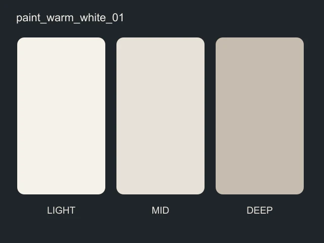
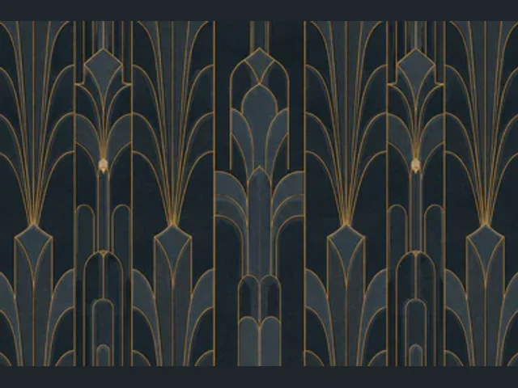
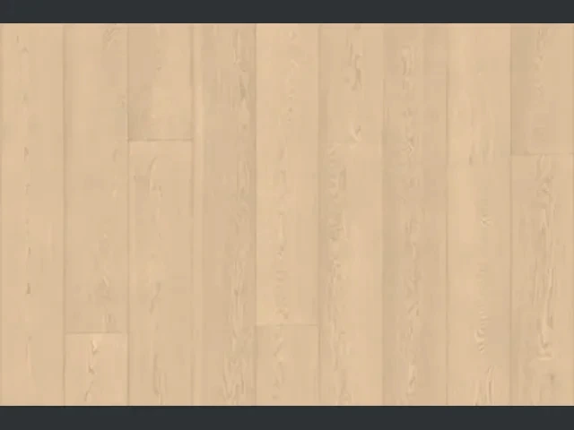
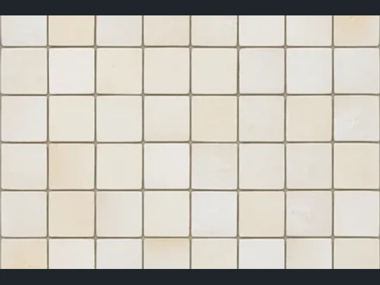
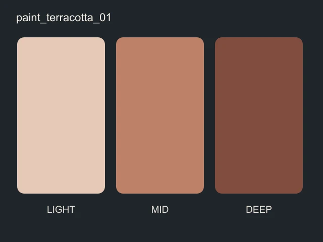
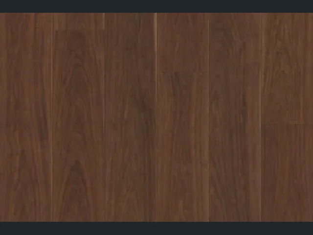
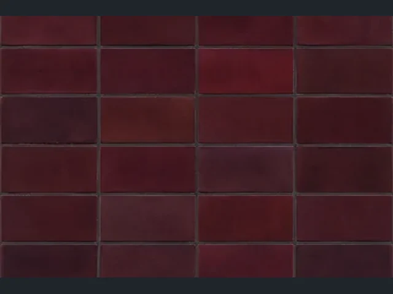

# AI 住宅装修设计 Agent

> 用一句话描述你想住的感受，AI 在可交互的 3D 户型里生成一套完整、可落地、可迭代的装修方案。

这是一个端到端的 **全栈 Agent 项目**：用户用自然语言表达居住感受（“明亮安静”“有记忆点”），
后端 Agent 基于一套自描述材质资产库，生成墙漆、墙纸、地板、瓷砖、吊顶五品类的设计方案，
并通过**无头浏览器渲染真实场景 + Critic 自评**验证视觉效果，最后在浏览器中以实时 3D 方式漫游与预览。
方案可分支、可回滚、可追溯、可离线评估。

🔗 **在线 Demo**：[my-house.vercel.app](https://my-house.vercel.app)

---

## 核心亮点

- **对话式设计 Agent，规划先行**
  用户提出需求后，Agent 先呈现一份实施规划，确认后再动手修改方案；SSE 流式返回回复，
  工具调用过程实时可见，整个过程不是黑盒。

- **视觉自评闭环**
  方案生成后由 Playwright 无头浏览器渲染真实 3D 场景、截图回传，Critic Agent 按视觉标准评审，
  不达标自动返工，把“审美好不好”变成可测量、可回归的质量门禁。

- **可寻址的自描述资产库**
  72 个材质资产，覆盖墙漆 / 墙纸 / 地板 / 瓷砖 / 吊顶五个品类。每个资产不只是图片，
  还携带视觉语义（角色、适搭、禁忌）、设计关系标签与参数化 Schema，
  Agent 通过工具检索与组合，而不是碰运气。

- **可复现的生成管线**
  户型与全部资产由 Blender 脚本参数化生成（Python API → glTF），并有独立的验证脚本
  校验资产完整性、坐标轴、UV 与导出结果——输出可复现，而非只靠渲染图。

- **方案版本管理**
  每次设计运行（Design Run）独立隔离，可基于当前方案分支、续跑或回滚，
  多轮对话的改动历史可完整追溯。

- **可观测与离线评估**
  全链路 LangSmith 追踪（对话、工具、渲染证据、嵌套 Critic）；`evals/` 提供
  结果质量、规划、轨迹三个维度的离线评估框架，用数据衡量 Agent 表现。

---

## 材质库一览

72 个资产均带 PBR 贴图与缩略图，前端以“资产卡”呈现：

| 墙漆 | 墙纸 | 地板 | 瓷砖 |
| --- | --- | --- | --- |
|  |  |  |  |
|  |  |  |  |

---

## 工作原理

```text
用户自然语言需求
      │
      ▼
┌─────────────────────────────┐
│  Agent（LangGraph）          │
│  1. 规划：拆解为可执行步骤    │
│  2. 检索：资产卡 / 知识库     │
│  3. 组合：按视觉标准选材      │
│  4. 落盘：生成 Design Run    │
└─────────────────────────────┘
      │
      ▼
   实时 3D 预览（Three.js）
      │
      ▼
无头浏览器渲染 → 截图 → Critic 评审 → 不达标自动迭代
```

---

## 快速开始

### 1. 启动前端（3D 查看器 + /chat 对话页）

```bash
cd viewer
npm install
npm run dev
# 打开 http://localhost:3000
```

### 2. 启动后端（Agent API）

```bash
pip install -r backend/requirements.txt
python -m uvicorn backend.agent_api.main:app --host 127.0.0.1 --port 8000
```

后端通过**项目专属** `HOUSE_DESIGN_*` 环境变量配置模型 provider（支持 OpenAI / 阿里云百炼 / 火山方舟），
不读取系统级 `OPENAI_*` 等通用变量，防止凭据误投递。完整配置说明见
[`docs/DEPLOY.md`](docs/DEPLOY.md) 与 `backend/agent_api/config.py`。

要让 `/chat` 对话页连上后端，在 `viewer` 下设置：

```bash
NEXT_PUBLIC_AGENT_API_URL=http://127.0.0.1:8000
```

### 3. 如何体验

1. 进入主页，在 135㎡ 三居宽厅中漫游，选中墙面 / 地面 / 顶面；
2. 右侧方案面板选择材质，实时调整明度、饱和度、漆面等参数；
3. 点击右上角「对话助手」进入 `/chat`，用自然语言描述想要的效果，Agent 生成并应用方案；
4. 需要“看效果”的观察类需求，由 3D 查看器渲染场景并回传截图，完成视觉自评。

---

## 技术栈

| 层 | 技术 |
| --- | --- |
| 前端 | Next.js（Vinext）、React 19、TypeScript、Three.js、Tailwind |
| 后端 | FastAPI、LangGraph、LangChain、Pydantic |
| 渲染管线 | Blender Python API、glTF、Playwright（无头浏览器视觉自评） |
| 存储 | SQLite（会话 Checkpoint）、JSON（Design Run 隔离） |
| 可观测 | LangSmith |

---

## 项目结构

```text
viewer/                 前端：3D 查看器 + /chat 对话页（Three.js / React）
backend/
  agent_api/            Agent：对话、SSE 流式、工具、Design Run、视觉评估
  render_bridge/        渲染任务队列（Agent ↔ 浏览器渲染会话）
  render_worker/        无头浏览器渲染 worker（视觉自评门禁）
blender/                户型与资产生成、验证脚本
evals/                  离线评估框架（结果质量 / 规划 / 轨迹）
scripts/                本地启动与数据迁移脚本
docs/                   模型规格、材质系统、资产说明、部署文档
```

---

## 相关文档

- [`docs/MODEL_SPEC.md`](docs/MODEL_SPEC.md) — 3D 模型与资产规格
- [`docs/WALL_PAINT_SYSTEM.md`](docs/WALL_PAINT_SYSTEM.md) · [`docs/WALLPAPER_SYSTEM.md`](docs/WALLPAPER_SYSTEM.md) — 材质系统
- [`docs/DESIGN_VERSIONING.md`](docs/DESIGN_VERSIONING.md) — Design Run 与方案版本
- [`docs/DEPLOY.md`](docs/DEPLOY.md) — 前端 / 后端部署
- [`docs/AGENT_EVALUATION_REPORT.md`](docs/AGENT_EVALUATION_REPORT.md) — Agent 评估报告

---

## 免责声明

本项目是 AI Agent 技术与 3D 可视化的工作演示，用于产品流程与设计方法验证。
输出不构成施工图，不对结构、消防、防水或当地住宅规范作任何承诺；
涉及工程落地的内容应由有资质的现场专业人员确认。

## License

本项目尚未指定开源协议，代码仅作作品展示与学习参考。
