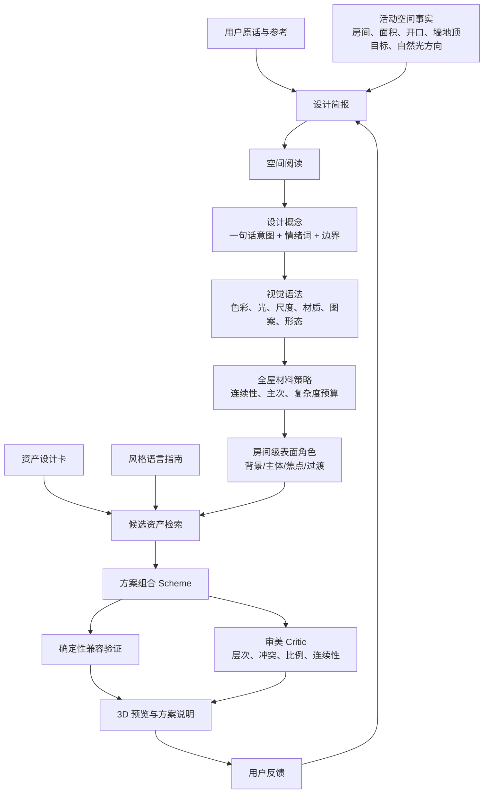

# 住宅硬装审美设计知识底稿

> 版本：0.1（知识底稿，不是运行时 System Prompt）  
> 适用范围：住宅室内的**外观、氛围与材料组合设计**。当前项目只设计墙漆、墙纸、地板、瓷砖、吊顶，并以固定住宅模型中的墙面、地面和顶面为落地对象。  
> 明确不包含：施工工艺、报价、工程量、节点做法、结构改造、机电、消防、防水、验收、施工组织、品牌 SKU 或采购承诺。涉及这些内容时，Agent 必须说明“不在本知识库/能力范围内”，交由有资质的现场专业人员确认。

---

## 1. 这份知识解决什么问题

住宅审美设计不是给一个空间贴上“某某风格”的标签，也不是按颜色关键词随机挑选材料。它是在已有空间边界内，利用色彩、光、材质、图案、尺度感和顶面形态，组织出一种可感知、可解释、可修改的空间体验。

对本项目而言，设计能力应回答五个问题：

1. 用户希望居住在什么感觉里？例如明亮、安静、包裹、克制、有记忆点，而不只是“想要奶油风”。
2. 现有空间的自然光、开口、面积、比例、墙面完整性和房间关系，支持或限制什么视觉策略？
3. 墙、地、顶三大连续表面分别承担背景、主体、焦点还是过渡角色？
4. 从真实存在的资产中，怎样选出彼此相容的墙漆、墙纸、地板、瓷砖和吊顶？
5. 方案为什么成立；若用户说“太冷”“太满”“不够高级”，下一步应局部改什么而非推倒重来？

本文件是后续三类知识资产的上游依据：

- `AestheticAssetCard`：一项具体资产在视觉上是什么、会带来什么空间效果、适合和不适合什么；
- `StyleLanguageGuide`：一种可复用的设计语言，不是固定材料套餐；
- `DesignSkill`：访谈、形成简报、检索、组合、审美检查、出方案和吸收反馈的流程。

## 2. 范围和边界

### 2.1 本项目设计的对象

| 品类 | 审美设计中关注什么 | 当前输出形式 |
|---|---|---|
| 墙漆 | 色相、明度、冷暖、灰度、漆面光泽、墙面整体安静度 | 某面墙的 `asset_id` |
| 墙纸 | 图案类型、尺度、重复、底色、对比、肌理、焦点/满铺角色 | 某面墙的 `asset_id` |
| 地板 | 木色、纹理对比、板幅感、拼法、方向、光泽、连续性 | 某地面的 `asset_id`，未来可加铺法参数 |
| 瓷砖 | 色泽、石纹/颗粒/图案、模数、缝的可见度、铺贴方向、干湿空间气质 | 某地面或允许的湿区墙面的 `asset_id`，未来可加铺法参数 |
| 吊顶 | 平整/层次、边界、阴影缝、灯槽的视觉语言、顶面重量感 | 某顶面的 `asset_id` / 几何预设 |

### 2.2 不把“审美”伪装成工程结论

下列表述可以作为视觉建议：

- “大尺度、低对比的地面会让公共区显得更连续。”
- “强图案墙纸更适合在无门窗的完整墙面承担焦点。”
- “低饱和暖灰墙面可以缓冲冷灰石纹与暖木地板之间的温差。”

下列内容不应由当前 Agent 判断或承诺：

- 某吊顶能否安装、下降多少才合规；
- 某材料防水、防滑、环保、耐磨是否达到现场要求；
- 某墙能否拆改、某工法是否可实施；
- 精确用量、报价、工期、品牌库存、色卡还原和最终施工效果。

`硬约束`（例如当前清单中湿区墙只能使用 tile、资产只适用于特定类别）可以由程序验证；其目的是防止系统给项目本身生成不兼容的 Scheme，不等同于施工规范判断。

## 3. 室内审美设计的知识图谱



这是一张**依赖图**，不是自动化顺序的铁律。用户已明确的偏好可以直接缩短访谈；预览中的反馈可以推翻最初的风格猜测。执行层的唯一事实仍是经过验证的 `Scheme JSON`，而不是自然语言描述。

## 4. 基础视觉语法：设计师到底在看什么

### 4.1 设计元素：被组织的“词汇”

| 元素 | 在硬装中的表现 | 设计判断 |
|---|---|---|
| 空间与留白 | 房间的长宽高感、开口、连续视线、墙面完整度 | 先看空间本身，不把材料当成遮盖空间问题的滤镜 |
| 线 | 木地板板缝、条纹墙纸、砖缝、吊顶边界、阴影缝 | 线的方向会组织视线；同一视域中过多不一致方向会显乱 |
| 形 | 墙纸图案、砖模数、吊顶轮廓、开口形状 | 形态需要有主导语言，曲直、疏密和软硬可对比但要有理由 |
| 色彩 | 色相、明度、饱和度、冷暖、灰度 | 色不是孤立色卡，必须在材料、光、相邻色和面积中判断 |
| 明暗与光 | 自然光方向、阴影、反射、表面光泽 | 光决定材料如何被读到；同一颜色在不同光下并不等效 |
| 肌理/纹理 | 漆面微表面、木纹、石纹、织纹、颗粒、压纹 | 区分“近看可读的微纹理”与“远看抢眼的大图案” |
| 材料感 | 木、矿物、陶瓷、纸、涂料等触觉联想 | 不只问像不像真材质，还要问它在整体中承担温度、重量还是秩序 |
| 光泽 | 哑光、蛋壳光、柔光、亮光、反射强弱 | 光泽会改变颜色深浅、视觉重量、精致或日常的感受 |
| 尺度 | 图案单元、板幅、砖模数、线槽相对房间和人眼的大小 | 尺度不是尺寸本身，而是尺寸与空间、人体和相邻元素的关系 |

### 4.2 设计原则：怎样把“词汇”组织成句子

| 原则 | 作用 | 在本项目中的可观察表现 |
|---|---|---|
| 统一 | 让空间像同一个整体 | 重复有限的底色、木色、矿物色或线性语言 |
| 变化 | 避免全屋像一个无重点的色块 | 在局部房间、焦点墙或顶面细节有可控差异 |
| 层级/强调 | 决定先看什么、后看什么 | 大多数面安静，只有一处或少数关系承担记忆点 |
| 平衡 | 分配视觉重量，而不是强迫左右对称 | 深色/强图案/高反差不要全部压在同一视域一侧 |
| 比例 | 处理局部与整体的关系 | 焦点墙的面积、吊顶边界的厚薄、图案的覆盖量恰当 |
| 尺度 | 让材料与空间的体量感相称 | 小房间避免高密度大对比图案；宽厅避免过碎的地面节奏 |
| 节奏 | 让重复、间隔和方向有秩序 | 条纹、板缝、砖缝、吊顶边线与开口共同组织视线 |
| 对比 | 建立可读性和张力 | 冷暖、明暗、粗细、光哑对比要服务重点，而不是全面开战 |
| 克制 | 保留视觉呼吸 | 不因“高级”而叠加石纹、木纹、花纹、金属线和复杂吊顶 |

没有任何单一比例、固定色值或“高级公式”能够自动保证好看。判断来自元素之间的关系、使用面积、观看距离、自然光和用户偏好。

### 4.3 三个必须区分的概念

1. **明度不等于饱和度**：米白和浅绿都可很亮；低饱和不必然是浅色。
2. **纹理不等于图案**：微水泥颗粒、亚麻纤维是近距离的微纹理；格纹、花卉、Damask 是远距离可识别的图案。
3. **风格不等于材料名称**：浅橡木可以用于北欧、原木自然、温暖极简或现代极简；由它和其他元素的角色关系决定设计语言。

## 5. 住宅空间阅读：设计开始前必须知道什么

审美设计不是先问“选哪个风格”。先把可设计空间读成一个视觉问题。

### 5.1 空间事实层（来自场景清单或用户确认）

- 房间名称、用途、面积、相邻关系；
- 可设计的墙、地、顶目标及其真实 ID；
- 每面墙的完整性、门窗开口、朝向和可见范围；
- 采光面、主要自然光方向、是否为开阔公共区；
- 房间之间是否连续可见，例如客厅—餐厅—走廊；
- 已有且不可改的主色、门窗框、固定柜体或用户必须保留的元素；
- 项目资产类别与资产的客观兼容性。

这些是**事实**，不得由模型凭印象补全。目标 ID、资产 ID 与兼容关系必须通过清单或工具读取。

### 5.2 视觉诊断层（可解释的审美推断）

| 观察 | 可推断的视觉问题 | 可能的设计回应 |
|---|---|---|
| 公共区连通、同一视线能看见多面墙和大片地面 | 连续性比单房间花样更重要 | 用连续地面和稳定背景墙建立基调；焦点限量 |
| 墙面有大量门窗或被切碎 | 它不适合承载完整大图案 | 用安静墙漆或细腻材质；把焦点移到完整墙面 |
| 采光很强 | 高反射、过浅表面容易显得发白或塑料 | 用低/中光泽、可读微纹理和适度明暗层次 |
| 采光偏弱或空间进深大 | 深色和强纹理的面积需要谨慎 | 先确保主要背景的明度与连续性，再决定是否局部包裹 |
| 顶面很完整、房间边界清楚 | 吊顶可成为秩序或层次工具 | 选择平顶、阴影缝、周边层次等与整体线条一致的语言 |
| 空间紧凑 | 图案尺度、对比和分割线都更敏感 | 减少切分，低对比材料优先，以一处重点代替处处装饰 |
| 空间大而空 | 纯白平面可能显得缺少重心 | 用地面温度、局部墙面、顶面边界或材质层次建立秩序 |

这些是“建议”，不是绝对规则。小空间也可以用深色制造包裹感；关键是用户意图、可见面积和其余表面的退让。

### 5.3 观看路径

每个房间至少考虑四个视觉时刻：

1. **入口第一眼**：哪一个面或哪一种明暗关系建立第一印象？
2. **停留视角**：坐下、吃饭、睡前时最常看的墙、地、顶如何相处？
3. **近看细读**：靠近墙纸、地板或砖时，尺度与微表面是否可信、耐看？
4. **跨空间回望**：门口、走廊、客餐厅相望时，是否仍像同一套住宅？

3D 预览应按这些时刻检查，而不是只用一张“最好看”的固定截图。

## 6. 色彩知识：从色卡到空间色彩故事

### 6.1 色彩描述的共同语言

- **色相**：偏黄、偏红、偏绿、偏蓝等色彩方向；
- **明度**：视觉上的明暗；
- **饱和度/彩度**：颜色的鲜艳程度；
- **冷暖**：相对感受，不是绝对属性。带灰的暖米色可与暖木协调，偏蓝灰可使空间更清醒；
- **灰度/浊度**：颜色被中性灰“压低”的程度。高灰度往往更安静、更容易大面积使用；
- **底色/undertone**：近白、灰、米色中隐含的偏黄、偏粉、偏绿、偏蓝等方向；
- **面积效应**：同一色样在整面墙、连续多面墙或小样上看起来不同；
- **同时对比**：相邻色会改变彼此的冷暖、明暗和纯度感受；
- **光源与自然光影响**：屏幕、白天、傍晚与不同人工光下的感受不同。

因此，Agent 可以描述“偏暖、低饱和、中浅明度、哑光”，不能把屏幕 `sRGB` 值说成现场最终色彩。

### 6.2 色彩故事（color story）

色彩故事不是“选三种颜色”的配方，而是解释全屋颜色如何分工：

| 角色 | 常见占比倾向 | 作用 |
|---|---:|---|
| 基底色 | 最大面积 | 墙、顶或连续地面中的安静基调，决定整体明暗与冷暖基线 |
| 主材料色 | 第二视觉重量 | 通常来自木地板、砖或稳定的墙面材料，提供温度和材料感 |
| 过渡色 | 少量但分布广 | 连接冷暖、明暗或材质，例如暖灰、灰米、石色 |
| 焦点色/图案 | 小面积、高记忆度 | 墙纸、局部深色墙、装饰砖等；必须有明确观看位置和退让背景 |

“60/30/10”可作为初学者检查主次的粗略提醒，但不是强制比例，更不应直接用于每个房间。

### 6.3 常用色彩关系

| 关系 | 做法 | 感受与风险 |
|---|---|---|
| 同类/邻近 | 同一温度或相邻色相，以明度和材质区分 | 容易统一、安静；若明暗和材质都过于接近，空间会没有层次 |
| 暖基底 + 冷灰/矿物过渡 | 暖白、米灰、木色与灰石/蓝灰小面积连接 | 有成熟感；需用中性灰米或相近明度避免生硬 |
| 冷基底 + 暖木 | 冷白/浅灰墙配自然木 | 明亮、清爽；木色过黄或墙过蓝会显得割裂 |
| 明暗对比 | 浅背景中有一面中深色或深地面 | 可建立重心和包裹；深色面积失控会压低空间 |
| 低饱和单色调 | 同色相不同明度、光泽和纹理 | 高度克制；要靠材质和光影避免单薄 |
| 小面积强调色 | 在大面积中性背景上局部加入陶土、橄榄、深蓝等 | 形成记忆点；不可在多个表面同时争夺注意力 |

### 6.4 顶、墙、地的明暗关系

这是视觉层级，不是施工规则：

- **轻顶—中墙—较重地**：最常见、稳定，重心靠下；
- **轻顶—轻墙—温润地**：明亮、松弛，依靠地面提供温度；
- **轻顶—中深墙—中地**：更包裹、戏剧化，适合明确想要安静或深沉感的局部空间；
- **顶墙接近、用阴影缝分界**：现代、整体，边界由线与光而非色差建立；
- **顶面强于墙地**：风险较高，只在顶面确实是概念重点时使用，避免压顶或喧宾夺主。

## 7. 材质与 CMF：颜色、材料、表面处理必须一起看

CMF 指 Color（色彩）、Material（材料）、Finish（表面处理）。同一色相做成哑光涂料、织物墙纸、亮釉砖或木材，空间感完全不同。

### 7.1 材质的五个阅读维度

1. **颜色与底色**：偏暖、偏冷、偏灰、明暗；
2. **图形信息**：素、线性、颗粒、木纹、石纹、花纹、叙事图像；
3. **对比度**：纹理是低对比背景，还是高对比视觉焦点；
4. **光泽与反射**：吸光、柔和反射、明显镜面；
5. **触觉联想与视觉重量**：木的温度、石的沉稳、陶瓷的洁净、纸织物的柔和、涂料的安静。

### 7.2 材质复杂度预算

一个空间能承受的“信息量”有限。可用下面的非数值检查取代虚假的精确分数：

- 是否已存在一个高对比、大尺度或高色彩的焦点？若有，其余连续面应降低图形信息；
- 木纹、石纹、墙纸图案是否在争夺同一个观看距离的注意力？
- 吊顶边线是否与地板/砖缝/墙纸条纹共同形成过多方向？
- 是否至少有足够大面积的安静表面，让眼睛休息？

经验原则：**一处强图案 + 一处有性格的主材料 + 其余安静背景**往往比每一面都“有设计感”更耐看。

### 7.3 真实感与审美不是一件事

项目中的 PBR 纹理负责在 3D 中表达合理的微表面、粗糙度、法线和尺度；它不能替代设计判断。即使材质很真实，过大的木纹、错误尺度的墙纸重复、过亮的反射或无节制的图案组合仍会破坏审美。反过来，克制的低对比表面不应被误判为“没材质”。

## 8. 五类资产的专业知识

### 8.1 墙漆

**它的核心角色**：墙漆通常是最大的连续背景，是全屋色彩和光感的底盘，不一定是“最有戏”的材料。

需要理解：

- 近白绝不是一种颜色：暖白、奶油白、冷白、灰白、粉白、绿灰白会与木、石、窗外光产生不同关系；
- 墙漆的综合色比小样更强，应把相邻地面、顶面、门窗框和自然光一起看；
- 高灰度、低对比的墙漆适合大面积退后，复杂墙纸/地板需要这种背景；
- 中深色墙漆可提供包裹和重心，但应明确它服务的是焦点、睡眠感还是空间边界；
- 哑光更安静、隐藏反射；蛋壳光会提升细微反射和精致度，同时改变明暗读法；
- 真实涂料墙的微纹理应只在近距离或掠射光下出现，远景仍应平静。

常见失误：把所有房间刷成同一“网红奶油色”却不处理光线和地面底色；墙、顶、地明度过于接近又没有材质差异；为显质感而把墙面纹理做成粗糙斑驳。

### 8.2 墙纸

**它的核心角色**：墙纸是最容易迅速建立主题、节奏或亲密感的墙面材料，也是最容易过量的视觉信息。

必须记录的视觉知识：

- 图案类型：素色肌理、细小满铺、条纹/格纹、几何、植物、古典纹章、抽象笔触、风景壁画；
- 图案尺度：单元相对墙面、门窗和观看距离的大小；
- 重复与方向：循环尺寸、直对/错位等是资产事实；在 3D 中还要确保图案方向与真实尺度可信；
- 底色、图案对比与留白：同样的花纹，低对比会成为背景，高对比会成为焦点；
- 使用角色：焦点墙、连续包裹、局部壁画、轻微肌理背景；
- 墙面条件：无开口、完整、进入视线的位置通常比破碎门窗墙更适合承载强图案。

设计判断：

- 强图案通常只选一个视觉明确的面；
- 条纹能带来方向和秩序，但应与地板、砖缝、吊顶线的方向协调；
- 大幅壁画需要完整观看距离与足够退让的相邻表面；
- 小尺度重复并不天然“安全”：高对比密集小花纹依然会造成视觉噪声；
- 墙纸的“高级”不等于复杂，低对比织纹、矿物感也可以只提供近看的层次。

常见失误：所有墙满铺高对比墙纸；将壁画或大图案放在开口破碎墙；重复尺寸失真导致巨大图案或密集摩尔纹；墙纸、强石纹地面和高色差木纹同时争抢。

### 8.3 地板

**它的核心角色**：地面是全屋最连续、最接近人体的主材料，常承担温度、尺度和空间连续性的职责。

需要理解：

- 木色：白蜡/浅木的清爽、自然橡木的平衡、蜂蜜木的温度、胡桃/深木的稳重、烟熏与灰洗木的成熟感；
- 木纹对比：低色差细纹安静、容易做大面积背景；高色差和大节疤更有性格，也更需要其余表面退让；
- 板幅与拼法感知：长直板连续、平静；人字/鱼骨节奏更强、装饰性更高；
- 方向：沿主要视线或长边方向通常加强延伸感；与空间主要线性关系故意对比也可以，但必须控制其余线条；
- 光泽：低光泽更自然、稳定；高反射会放大光源和环境反射，可能显得浮或假；
- 全屋连续性：客餐厅、走廊等连续区域通常优先共享地面语言，局部变化要有空间分区或情绪理由。

常见失误：用过黄木色搭配过蓝冷灰墙；木纹尺度在 3D 中不可信；公共区每个小区域换一种地面，破坏连续性；选择强拼法又叠加强条纹墙纸和复杂吊顶。

### 8.4 瓷砖

**它的核心角色**：瓷砖可以是干净、矿物、石材、秩序或装饰图案的语言。它在本项目中适用于地面，以及清单明确允许的湿区墙面。

需要理解：

- 表面语言：素色陶瓷、白色石纹、暖米洞石、深灰岩石、水泥/微水泥、水磨石、木纹砖、花砖/小砖；
- 模数与砖缝：模数大、缝弱，画面更完整；模数小、缝与重复更明显，节奏更强；
- 纹理方向和尺度：石纹、木纹、拼接方向要与空间主线和相邻材料协调；
- 明度与光泽：亮面、哑面、颗粒感会改变洁净、温润、复古或冷峻的感受；
- 墙地关系：同一砖上下连续会形成整体包裹；墙地相近但不同模数可更有层次；高对比墙地会产生强分割。

常见失误：把砖缝、石纹、花砖都作为同一空间的强重点；湿区墙地使用不同高对比材料却没有过渡；小空间用大尺度高对比石纹使画面拥挤；把瓷砖的视觉选择误说成防水、耐磨或施工建议。

### 8.5 吊顶

**它的核心角色**：吊顶不是“装饰天花板”这么简单；在审美范围内，它用于组织顶面边界、光影、秩序和空间的轻重。

当前可用的设计语言：

| 吊顶类型 | 视觉含义 | 更适合的设计关系 | 需要避免 |
|---|---|---|---|
| 原顶/平顶 | 最安静、最轻、最现代 | 希望空间完整、材料成为重点 | 为显得“有设计”强行增加线条 |
| 周边跌级/双眼皮 | 提供边界和精细线性层次 | 现代、温暖极简、需要轻微收口感 | 与过多墙纸条纹、砖缝、门框线叠加 |
| 周边下吊与灯槽 | 用柔和明暗组织顶面 | 希望有包裹、夜晚氛围或公共区秩序 | 让顶面成为压迫的主角 |
| 悬浮顶与阴影缝 | 强调轻薄、留白、当代感 | 现代极简、克制的矿物材料关系 | 与复杂古典图案或过多装饰线并用却无过渡 |
| 厨卫模块化大板 | 清洁、秩序、模块感 | 湿区的完整、简洁顶面 | 把它误当作可替代任何干区审美的默认方案 |

在这个项目里，吊顶的下降高度、安装方式和安全性不由审美 Agent 判断；Agent 只在资产卡标明的可用范围内选择其视觉预设。

## 9. 从“风格”到“设计语言”

### 9.1 风格为什么不能是标签或套餐

“现代极简”“原木自然”“中古”等名称是沟通捷径，但同一名称下可以有完全不同的明暗、材料和情绪。把风格写成“某风格 = 指定墙漆 + 指定地板 + 指定吊顶”的套餐，会让 Agent 只能模仿标签，不能理解用户说的“更明亮一点、不要太日式、保留一点复古感”。

正确模型是：

```text
风格名称（可选检索入口）
  -> 核心意图与边界
  -> 色彩故事
  -> 材料角色与纹理复杂度
  -> 主次关系、线条与顶面语言
  -> 可控变体和常见失败
  -> 资产卡中的具体可选项
```

### 9.2 一份风格语言指南必须包含的字段

```yaml
id: warm_restrained_minimalism
name: 温暖克制极简
intent: 用低饱和暖中性色、安静的连续表面和少量细节，形成明亮但不冷的住宅。
not_this: 不等同于全屋奶油色、堆砌圆弧或高反射“精致感”。
color_story: 基底为暖白/灰米；木色提供温度；深色只用于极少量重心。
material_roles:
  wall_paint: 大面积低对比背景
  wallpaper: 多为细腻肌理，慎用强图案
  floor: 自然浅木或中浅木，低至中纹理对比
  tile: 暖灰、灰米、低对比矿物感
  ceiling: 平顶或细阴影缝/周边轻层次
hierarchy: 地面和光影是主体，墙面退后；每个主要视域最多一个焦点。
safe_combinations: []
variants: []
failure_modes: []
interview_discriminators: []
```

### 9.3 当前建议的八个候选母版

这八个是项目建议的**第一批候选指南**，不是行业权威分类，也尚未代表系统已经具备八套知识。是否全部进入第一版，要以资产覆盖度和质量为准。

**用法边界（避免把知识库变成方向菜单）**：这八套只是描述与命名设计语言的参考词汇，**不是提供给用户的选项模板**。每次与用户讨论方向时，必须从用户当轮原话表达的感受、明暗与材料偏好生成选项，不得反复从这张表里抽取固定的几套作为套餐。表中某一套只有在用户主动提到的感受恰好与其核心意图对应时才可用于命名，且仍要落到该用户的具体取舍上。

| 候选设计语言 | 核心意图 | 与相邻方向的边界 |
|---|---|---|
| 现代极简 | 清晰比例、少量材料、线条与留白优先 | 不等于冷白空房，也不要求全无材质感 |
| 温暖极简／奶油克制型 | 温暖、柔和、低对比，但保持秩序 | 不等于全屋单一奶油色、过多圆弧和亮面 |
| 原木自然／Japandi | 自然木、柔和矿物、安静手感与平衡 | 不等于堆日式符号或把每面做粗糙“侘寂” |
| 侘寂自然 | 不完美、低光泽、安静包裹、材质时间感 | 不等于脏、暗、粗糙或无层次 |
| 北欧明亮 | 明亮空气感、浅木、清爽对比和轻松节奏 | 不等于所有东西都白，也不等于儿童化的彩色点缀 |
| 复古现代／中古 | 中深木色、成熟色彩、几何或图案记忆点 | 不等于把深色木、花纹和装饰物全部叠满 |
| 现代中式 | 当代秩序与东方留白、木色、矿物色之间的克制关系 | 不等于符号化格栅、红木化或传统元素拼贴 |
| 轻法式／现代古典 | 细腻比例、柔和明暗、少量古典秩序 | 不等于复杂线条、满屋花纹和“样板房”堆饰 |

一份方案可以混合多个设计语言，但必须写清谁是主导、谁只提供局部特征。例如：“材料关系以原木自然为主；线条与顶面接近现代极简；仅在主卧以低对比植物墙纸增加一点复古感。”

## 10. 组合设计：五类材料怎样一起工作

### 10.1 表面角色模型

将每个可设计表面明确为以下之一，而不是只写“好看”：

| 角色 | 目的 | 常见载体 |
|---|---|---|
| 背景 | 承接光线、扩大留白、让其他材料可读 | 大多数墙漆、平顶、低对比瓷砖 |
| 主体 | 提供全屋温度、尺度和材料基调 | 连续地板、主要地砖、稳定墙色 |
| 焦点 | 建立记忆点和视线终点 | 一面完整墙纸、局部深色墙、特色砖 |
| 过渡 | 缓冲冷暖、明暗、材质或空间分区 | 灰米墙漆、矿物砖、相近色墙地关系 |
| 收口/秩序 | 让边界、线条、顶面关系变得可读 | 阴影缝、细跌级、统一板缝方向 |

一个表面在不同房间可以有不同角色；但一个表面不要同时被赋予“背景、焦点、强纹理、深色、装饰线”的全部职责。

### 10.2 全屋连续性

全屋一致不是每个房间同样。它通常来自以下至少两项的重复：

- 同一地面或相近的材料温度；
- 同一基底墙色家族；
- 相同或相容的顶面线性语言；
- 限定的金属/木色/矿物色方向（在本项目中主要通过硬装材质呈现）；
- 每个房间都遵守相同的复杂度与光泽纪律。

然后允许卧室、卫生间或某个焦点墙拥有更私人的变化。连续公共区应优先看“跨门洞、跨视线”的画面，而不是逐房间独立配色。

### 10.3 图案、纹理、线条的竞争检查

在提交方案前依次问：

1. 本视域最强的信息是什么？它是否明确？
2. 是否出现两种以上强图案（包括高对比木纹、强石纹、花砖、条纹墙纸）？
3. 地板板缝、砖缝、墙纸条纹、吊顶线是否出现三种以上互不相关方向？
4. 若焦点墙移除，空间是否仍有稳定基底；若保留焦点墙，其他材料是否愿意退后？
5. 近看有细节、远看仍安静吗？

### 10.4 冷暖与明度的过渡

不要只用“暖/冷”二分。更可靠的做法是找一个同时带有两侧特征的过渡面：

- 冷灰砖 + 暖木地板：使用灰米、暖灰、浅石色墙面连接；
- 冷白自然光 + 米黄基底：用低饱和自然木或中性矿物材质避免黄蓝对撞；
- 深木 + 浅墙：让顶面、局部砖或墙纸底色共享其中一侧的灰度，而非增加第三种强色。

### 10.5 吊顶与材料的关系

- 材料图案强时，顶面多退后；
- 顶面线条强时，墙纸和地面拼法应更安静；
- 现代的细阴影缝可以用线性秩序统一墙、地的低对比材料；
- 带古典或复古语言的墙纸可配温和的边界层次，但不应再叠加无关的现代线槽；
- 同一公共区不要让顶面、地面和墙面同时承担“主角”。

## 11. 住宅硬装审美设计流程

### 步骤 0：确认任务边界

明确这次只是在出视觉方案，还是要实际修改当前 Scheme；明确要设计哪些房间、墙面、地面、顶面。若任务包含施工、预算、拆改或购买，拆出并说明当前不处理的部分。

### 步骤 1：收集设计简报

优先收集高信息量事实和偏好：

- 要改的空间与优先级；
- 用户对明亮/包裹、秩序/自然、低调/记忆点、木纹/石纹/图案容忍度的偏好；
- 已有元素与明确禁忌；
- 参考图中“具体喜欢/不喜欢什么”；
- 影响视觉方向的生活方式和维护偏好；
- 预算、采光、层高等只作为设计限制信息，不能被延展为工程结论。

不要一开始连问十个问题。每次只问当前最能缩小方案空间的一个问题；信息够用时停止。

### 步骤 2：读取空间与资产事实

从清单/工具读取房间、墙地顶目标、开口、允许类别和真实资产。不要从房间名称、历史对话或 ID 命名规律猜测。

### 步骤 3：做空间阅读

写出每个重点空间的：

- 第一视觉问题；
- 主要背景面、主体面、可做焦点的完整面；
- 最重要的跨空间连续关系；
- 光线与明暗风险；
- 不应该继续增加的信息类型。

### 步骤 4：形成一句话设计概念

格式：

> 为 `[谁/什么使用体验]`，以 `[核心感受]` 为主，用 `[主要材料/色彩关系]` 建立基底，并通过 `[唯一或少量焦点]` 提供记忆点；避免 `[明确禁忌]`。

示例：

> 为希望长期安静、但不想显冷的公共区，以明亮的暖灰米基底和自然浅木建立连续性，用一面低对比线性墙纸提供节奏；避免高反射和多种强图案并置。

### 步骤 5：确定全屋材料策略

先选连续性最强、面积最大的材料关系：地面基调、墙面基底、顶面语言。再限定每个公共视域的焦点数和纹理复杂度。

### 步骤 6：为每个房间分配表面角色

不要直接选 asset。先写：哪几面是背景、地面承担什么、是否有焦点墙、顶面是否退后或提供秩序。之后才以这些角色检索资产卡。

### 步骤 7：检索并比较候选资产

先用结构化条件筛选类别、可用空间、允许铺法/预设、授权状态；再用自然语言字段比较视觉描述、空间效果、搭配关系和禁忌。至少保留一个“更安静”和一个“更有记忆点”的方向，方便用户比较。

### 步骤 8：组成可执行方案

把选择落成 `Scheme JSON`：每个真实目标对应真实资产 ID。未来若扩展铺法、方向、图案定位等，必须先升级并审批 Schema，不能把它们藏在自然语言里。

### 步骤 9：双重检查

- **确定性验证**：目标存在、资产存在、类别兼容、目标级限制通过；
- **审美检查**：层级、冷暖、明暗、尺度、图案竞争、跨空间连续性、顶墙地职责、用户禁忌是否满足。

审美检查应输出“风险和理由”，不能假装是客观规范。例如：“客厅已有高对比胡桃木地板和深色焦点墙，再选高对比 Damask 墙纸可能让入口视域过满。”

### 步骤 10：3D 预览、对比与反馈修订

在入口、停留、细读、回望四类视角中检查。向用户展示差异明确的 2–3 个方案，而非三个轻微改色版本。把反馈翻译成可修改的设计变量：

| 用户反馈 | 先检查的变量 |
|---|---|
| 太冷 | 墙面底色、地面木色、矿物材料灰度、光泽，而不是立刻全换黄 |
| 太黄/太腻 | 暖白底色、木色饱和度、连续暖色面积、是否缺少中性过渡 |
| 太空/没质感 | 是否缺少微纹理、材质明暗、局部焦点或顶面层次，而非盲目加花纹 |
| 太满/太乱 | 焦点数量、图案竞争、线条方向、颜色数量和强反差面积 |
| 不够高级 | 先让用户说明是想要更精致秩序、天然松弛、深沉包裹还是更有记忆点，拒绝把“高级”当单一风格 |
| 不像我想要的风格 | 回到具体喜欢的颜色、材质、线条、光感和空间情绪，不只换风格标签 |

## 12. 自适应访谈知识

### 12.1 先问事实，再问感受，再做针对性区分

| 阶段 | 目标 | 高价值问题示例 |
|---|---|---|
| 范围 | 知道要设计什么 | “这次优先想看客餐厅，还是先做主卧？” |
| 生活/限制 | 避免忽视重要前提 | “你更在意容易清洁，还是更愿意保留天然、细腻的表面感？” |
| 空间情绪 | 找到主方向 | “你希望公共区更明亮清爽，还是更安静、有包裹感？” |
| 材质偏好 | 判断复杂度与温度 | “浅木的自然纹理和更平整的矿物感墙面，你更想让哪一个成为主角？” |
| 风格区分 | 只消除当前最大不确定性 | “你说的温暖更接近明亮浅橡木，还是灰泥和深木的安静感？” |
| 预览反馈 | 把感觉落回变量 | “这两个方向里，你喜欢的是地面的温度、墙面的安静，还是那面墙纸的节奏？” |

### 12.2 参考图的使用

参考图只能作为偏好线索，不是让 Agent 抄图或直接判定“这就是某风格”。应追问：

- 你喜欢的是整体明暗、木色、墙面、图案、顶面线条，还是空间的留白？
- 哪一部分不想要？
- 若只保留一个感觉，最想保留什么？

### 12.3 停止提问条件

当以下内容已足以让候选方案出现显著差异时，应出方向而非继续问卷：

- 已知设计范围和关键不可动元素；
- 已知主要情绪轴（至少明亮/包裹、秩序/自然、克制/记忆点）；
- 已知对木纹、石纹、图案和深色的关键接受度；
- 已知至少一个明确禁忌；
- 能提出两种可解释的材料策略。

## 13. 交付物：一份审美方案应包含什么

### 13.1 给用户看的方案说明

1. 方案名称（可用自然语言，不必强塞风格标签）；
2. 一句话概念；
3. 用户原话中哪些偏好被采纳；
4. 全屋的色彩与材料关系；
5. 每个重点房间的墙、地、顶角色与选择理由；
6. 焦点在哪里，其他表面如何退让；
7. 可能的审美取舍和可调变量；
8. 明确声明：这是概念级视觉方案，屏幕预览不替代实体样板和现场专业确认。

### 13.2 给系统执行的结构化结果

- `DesignBrief`：用户原话、确认事实、推断偏好、临时假设分开保存；
- `Scheme`：目标 ID 与资产 ID 的可验证映射；
- `Rationale`：每项选择引用的设计简报、风格指南/资产卡依据；
- `CriticResult`：通过项、风险、建议，不把审美风险伪装成硬错误；
- `PreviewFeedback`：用户喜欢/不喜欢的具体表面与原因。

## 14. Agent 知识建模：什么该放哪里

### 14.1 不要把所有知识塞进 System Prompt

System Prompt 应只保留角色、边界、事实优先级、工具使用规则与禁止编造的约束。大量专业知识直接硬编码会难更新、难引用、难评估，也会让 Prompt 变成第二事实源。

推荐分层：

| 知识/状态 | 推荐载体 | 谁负责 |
|---|---|---|
| 活动房屋、真实目标 ID、允许资产类别 | `scene_manifest.json` + 查询工具 | 代码与清单 |
| 资产尺寸、类别、适用性、许可、纹理尺度 | 资产清单 / `AestheticAssetCard` | 结构化数据 |
| 资产视觉描述、空间效果、搭配与禁忌 | `AestheticAssetCard` 自然语言字段 | 知识库 + LLM 理解 |
| 风格意图、边界、组合语法、失败模式 | `StyleLanguageGuide` | 可版本化 YAML/JSON/Markdown |
| 色彩、层级、图案竞争等通用原则 | 本 `design.md`，再拆成可检索规则片段 | 知识库 |
| 用户原话、已确认偏好、推断、假设 | `DesignBrief` / Agent State | 对话状态 |
| 目标—资产映射 | `Scheme JSON` | 受控执行层 |
| 类别兼容、ID 存在、目标级限制 | Validator | 确定性代码 |
| “是否好看、是否符合意图”的解释 | Critic + 用户反馈 | LLM 辅助判断，不能冒充客观事实 |

### 14.2 资产设计卡最小 Schema

```yaml
id: wallpaper_linear_warm_grey_01
name: 暖灰织纹线
objective_facts:
  category: wallpaper
  supported_targets: [wall_face]
  repeat_size_m: [0.53, 0.32]
  pattern_direction: vertical
  match_type: straight
  source_and_license: project_owned
visual_description: >
  低对比暖灰底上有细密竖向织纹；远看安静，近看可读纸织物微纹理。
spatial_effect: >
  提供轻微垂直节奏，不应成为空间唯一的强焦点。
works_well_with:
  - 浅色自然木、暖灰米墙漆、平顶或细阴影缝
avoid_when:
  - 同一视域已有强条纹地面、强几何吊顶或高对比石纹
style_roles:
  - 温暖克制极简中的低强度焦点
  - 现代极简中的材质层次
```

字段中的尺寸、类别、许可、适用性是事实；`visual_description`、`spatial_effect`、`works_well_with` 和 `avoid_when` 是专业判断，但必须具体、可反驳、可迭代。

### 14.3 审美 Critic 的输出契约

Critic 不应输出一个假装科学的“美学分数 87.3”。更有用的结果是：

```yaml
summary: 公共区连续性清楚，焦点集中在客厅西侧完整墙面。
supports_intent:
  - 暖灰米墙和浅自然木回应了“明亮但不冷”。
risks:
  - 客厅若同时使用高对比胡桃木地板与 Damask 墙纸，入口视域会出现两个同等级焦点。
recommended_revision:
  - 保留胡桃木时，墙纸改为低对比织纹；保留 Damask 时，地面改用低色差自然木。
needs_user_decision:
  - 用户更重视复古记忆点，还是公共区的安静连续性？
```

## 15. 常见失败模式与修正思路

| 失败模式 | 常见症状 | 根因 | 优先修正 |
|---|---|---|---|
| 标签替代设计 | “奶油风”却没有色彩、光泽、主次说明 | 风格被当成套餐 | 回到设计概念和材料角色 |
| 处处是重点 | 墙纸、深地板、花砖、吊顶都很强 | 没有层级 | 保留一个主焦点，其余退为背景 |
| 样板间堆叠 | 材料昂贵但画面拥挤、符号过多 | 把装饰数量误当品质 | 减少图案、线条和色彩种类 |
| 全屋复制粘贴 | 每个房间完全一样，缺少私人变化 | 把统一误解为同质 | 维持基底，允许局部情绪变化 |
| 房间各自为政 | 每间好看，连起来割裂 | 没有跨空间阅读 | 先定公共区连续材料和色彩过渡 |
| 错误尺度 | 巨大木纹、密集小墙纸、异常砖缝 | 忽略真实物理比例与观看距离 | 在资产卡存真实 repeat/module，预览中按米制映射 |
| 冷暖冲突 | 蓝灰墙、黄木、粉米砖互相打架 | 只看单件，不看底色 | 用灰米/石色等过渡并减少强色 |
| 只凭截图 | 一个机位好看，移动后图案/反射失控 | 没有观看路径验证 | 检查入口、停留、细读、回望 |
| 把渲染当现场 | 以屏幕颜色承诺最终交付 | 忽略光、样板和实体差异 | 明确概念预览边界 |
| 把工程问题交给审美 Agent | 询问能否施工、是否安全或合规 | 能力边界混乱 | 停止并转交相关专业人员 |

## 16. 方案验收清单

### 16.1 设计前

- [ ] 是否已明确这次只做视觉/材料方案？
- [ ] 是否知道重点房间和真实可设计表面？
- [ ] 是否区分了用户原话、确认事实、推断偏好和假设？
- [ ] 是否知道用户要的感受及至少一个明确禁忌？

### 16.2 组合前

- [ ] 是否有一句可验证的设计概念？
- [ ] 是否先确定了全屋地面、墙面基底和顶面语言？
- [ ] 每个重要表面是否有背景/主体/焦点/过渡/秩序角色？
- [ ] 是否识别了完整焦点墙和跨空间连续视线？
- [ ] 是否控制了图案、木纹、石纹、砖缝和吊顶线的竞争？

### 16.3 输出前

- [ ] 所有目标 ID 与资产 ID 是否来自真实清单？
- [ ] 兼容验证是否通过？
- [ ] 是否能解释每个关键选择如何回应用户偏好？
- [ ] 是否同时说明了一个主要取舍或风险？
- [ ] 是否在多个房间视角中检查了方案？
- [ ] 是否没有声称施工可行、价格、品牌 SKU 或最终实体效果？

## 17. 当前项目的落地次序

本文件是总览，不建议直接复制进系统提示词。合理的实施顺序是：

1. 审批 `AestheticAssetCard` Schema，并为五类资产各写 1 个高质量样例；
2. 审批 `StyleLanguageGuide` Schema，并先完整写 1 个风格语言样例；
3. 从本文件拆出“组合原则”和“Critic 输出”最小规则集；
4. 设计 `DesignBrief` 和自适应访谈的状态、问题选择逻辑、停止条件；
5. 用一个重点房间跑通：访谈 → 简报 → 资产检索 → 两个差异方案 → Scheme → Validator → 3D 预览 → 反馈；
6. 只有评估显示资产/风格检索已不足时，再增加全文检索或向量检索。

这样做的原因是：专业知识应可版本化、可引用、可单独评估；受控 Scheme 和 Validator 仍负责执行正确性；用户最终对“好不好看”的反馈才是审美系统持续校准的依据。

## 18. 参考与研究边界

本底稿以住宅硬装审美范围为项目化归纳，不等同于完整室内设计职业资格教材。行业教育与职业框架普遍同时涵盖空间规划、材料、光色、技术文件、规范与协作；本项目有意只取其中与视觉概念、材料选择和设计表达有关的部分。

- [CIDA Professional Standards](https://cida.org/professional-standards)：室内设计专业教育标准的当前入口；其标准涵盖设计元素与原则、光与色、材料等基础能力。
- [CIDA Professional Standards 2020（PDF）](https://cida.org/s/II-Professional-Standards-2020.pdf)：对色彩术语、色彩理论、色彩与材料/纹理/光/形态关系的具体说明。
- [CIDQ：What Is Interior Design?](https://www.cidq.org/about-cidq/what-is-interior-design/)：将发现与编程、概念发展、设计发展与选择列为室内设计过程阶段；本项目只采用前述过程中的审美设计部分。
- [WBDG：Form](https://www.wbdg.org/resources/form)：关于形、尺度、比例、纹理、颜色和光如何共同影响空间感知的基础说明。

